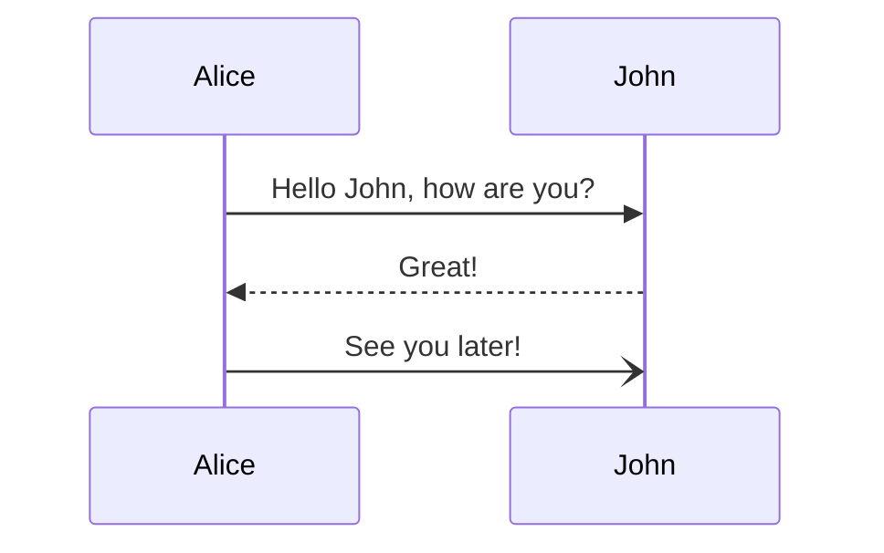
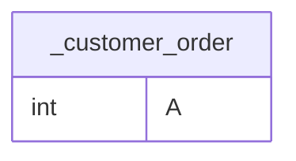

# This is a test file

This should demonstrate the abilities of markdown.

## Code

So sometimes we want to put `code` into our documents and directly have it goodly formated as we programmers can't read
not colored code.

### Kotlin

```kotlin
fun main() {
    println("Hello World")
}
```

### JavaScript

```javascript
console.log("Hello World")
```

### Java

```java 
class Main {
    public static void main(String[] args) {
        System.out.println("Hello World")
    }
}
```

### Mermaid Diagrams



and



### Python

```python
print("Hello World")
```

## Other multimedia types:


> this is a note. If you want to read it, do that.
> > This is a note inside a note...

Text that is _cursive_, __fat__, ___fat and cursive___. But also ~~strikethrough~~!
With that we can make the Text more readable.

A BTW here you can get back to [home](/).

<div>
    <h1>This is a header in an HTML-Container.</h1>
    <button>Here we go.</button>
    <label>
        Date here: <input type="datetime-local" >
    </label>
</div>


<table>
<tr>
<th> Good </th>
<th> Bad </th>
<th> Whatever </th>
</tr>
<tr>
<td>

```c++
int foo() {
    int result = 4;
    return result;
}
```

</td>
<td>

```c++
int foo() { 
    int x = 4;
    return x;
}
```

</td>
<td>

A boring text with _cursive_ __big__ text.
Also, we have `code` inside. Maybe a good Idea.
[YouTube](https://youtube.com)

</td>
</tr>
</table>